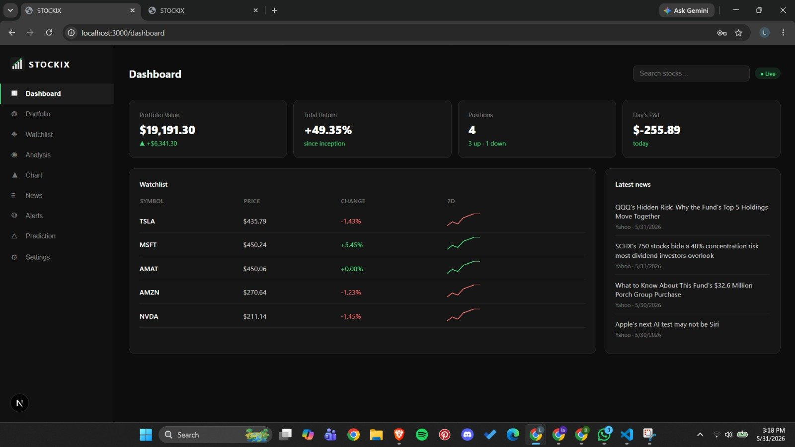
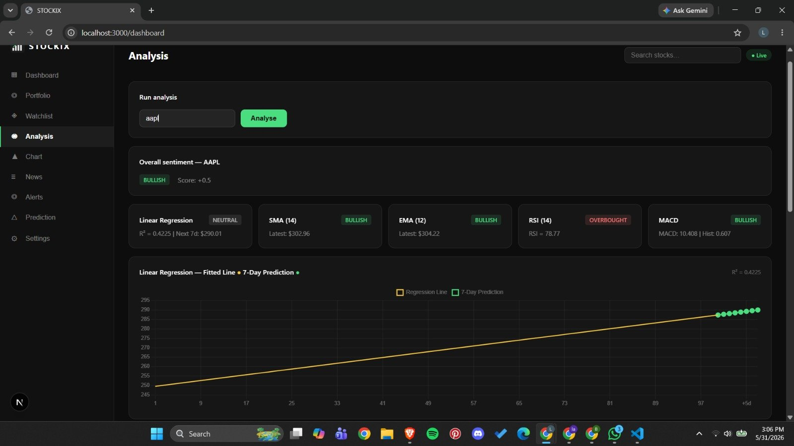
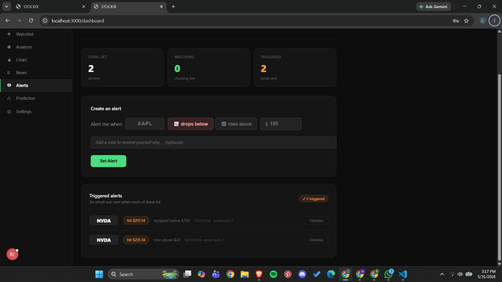
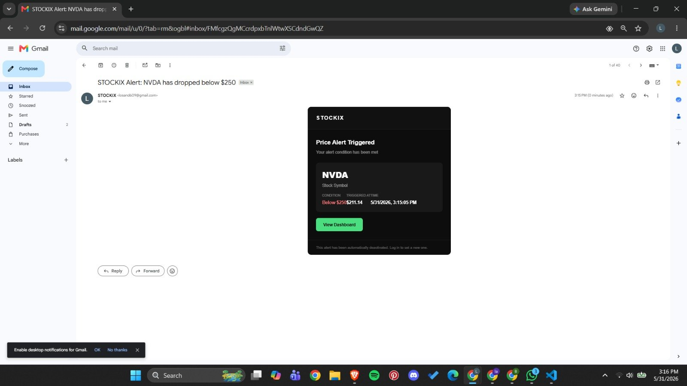

# 📈 STOCKIX — Stock Market Monitoring Platform

A full-stack stock monitoring platform with real-time prices, technical analysis, LSTM-based price prediction, and automated price alerts with email notifications.


---

## ✨ Features

- 📊 **Live Portfolio Tracking** — real-time P&L, positions, daily change
- 👁️ **Watchlist** — monitor any stock with live prices and sparklines
- 📉 **Technical Analysis** — SMA, EMA, RSI, MACD, Linear Regression with interactive charts
- 🧠 **LSTM Price Prediction** — 7-day forecast using a trained neural network
- 🔔 **Price Alerts** — set target prices, get email notifications automatically
- 📰 **Market News** — latest headlines per stock from Finnhub
- 🔐 **JWT Authentication** — secure login with bcrypt password hashing
- 🛡️ **Rate Limiting + Input Validation** — production-grade security
- ✅ **61 Automated Tests** — unit + integration tests with Jest

---

## 🖥️ Screenshots

**Dashboard** — Live portfolio summary, watchlist with sparklines, and latest market news


**Technical Analysis** — Linear Regression, SMA, EMA, RSI, MACD with overall sentiment score


**Price Alerts** — Sentence-style alert creation with triggered alert history


**Email Notification** — HTML alert email sent automatically when a price target is hit


---

## 🏗️ Architecture

```
Frontend (Next.js :3000)
        ↓
Backend API (Express :5000)
        ↓                    ↓
   MongoDB              Python ML Service
  (Database)            (Flask :5001)
                        LSTM Neural Network
```

---

## 🛠️ Tech Stack

| Layer | Technology |
|---|---|
| Frontend | Next.js 16, TypeScript, Chart.js |
| Backend | Node.js, Express, JWT, bcryptjs |
| Database | MongoDB, Mongoose |
| ML Service | Python 3.11, Flask, TensorFlow, Keras |
| Alerts | node-cron, nodemailer (Gmail) |
| Testing | Jest, Supertest, mongodb-memory-server |
| Data APIs | Finnhub, Alpha Vantage |

---

## 🚀 Quick Start

### Prerequisites
- Node.js 18+
- MongoDB
- Python 3.11
- Finnhub API key (free at [finnhub.io](https://finnhub.io))

### 1. Clone the repo
```bash
git clone https://github.com/yourusername/stockix.git
cd stockix
```

### 2. Backend setup
```bash
cd stockix-backend
npm install
cp .env.example .env
# Fill in your values in .env
npm run dev
```

### 3. ML service setup (separate terminal)
```bash
pip install flask numpy pandas scikit-learn tensorflow
python ml_service.py
```

### 4. Frontend setup (separate terminal)
```bash
cd stockix-frontend
npm install
npm run dev
```

Open [http://localhost:3000](http://localhost:3000)

---

## ⚙️ Environment Variables

Create a `.env` file in `stockix-backend/`:

```env
PORT=5000
MONGODB_URI=mongodb://localhost:27017/stockix
JWT_SECRET=your_min_32_char_secret_here
FINNHUB_API_KEY=your_finnhub_key
ALPHA_VANTAGE_API_KEY=your_alphavantage_key
EMAIL_USER=yourgmail@gmail.com
EMAIL_PASS=your_gmail_app_password
ADMIN_EMAIL=admin@example.com
ADMIN_PASSWORD=strong_password_12chars
```

> **Note:** `EMAIL_PASS` must be a [Gmail App Password](https://myaccount.google.com/apppasswords), not your regular Gmail password.

Generate a strong JWT secret:
```bash
node -e "console.log(require('crypto').randomBytes(64).toString('hex'))"
```

---

## 🧠 LSTM Price Prediction

The ML microservice trains a neural network on historical closing prices and predicts the next 7 days.

**Architecture:**
```
Input (60 days) → LSTM(128) → Dropout(0.2) → LSTM(64) → Dropout(0.2) → Dense(32) → Dense(1)
```

**How it works:**
1. Fetches 100 days of closing prices from Finnhub
2. Normalises data to 0–1 range
3. Trains LSTM model on price sequences
4. Predicts next 7 days one at a time
5. Returns predictions, trend, and confidence score

**Example response:**
```json
{
  "symbol": "AAPL",
  "currentPrice": 312.06,
  "predictions": [315.62, 317.32, 319.01, 320.70, 322.37, 324.02, 325.66],
  "predictedDay7": 325.66,
  "priceChangePct": 4.36,
  "trend": "bullish",
  "confidence": 0.95
}
```

---

## 🔔 Price Alerts

Set a price target for any stock and get an email when it's hit.

```
Alert me when  [AAPL]  [📉 drops below]  [$150]
```

- Background job checks every **5 minutes**
- Each alert fires **exactly once** (no duplicate emails)
- HTML email sent with triggered price, timestamp, and dashboard link

---

## ✅ Tests

```bash
cd stockix-backend
npm test
```

```
Test Suites: 6 passed
Tests:       61 passed
Time:        ~12s
```

| File | Tests | What it covers |
|---|---|---|
| alert.model.test.js | 10 | Schema validation, trigger logic |
| user.model.test.js | 12 | Password hashing, auth methods |
| portfolio.model.test.js | 8 | Position CRUD |
| watchlist.model.test.js | 7 | Item management |
| auth.routes.test.js | 11 | Register, login, token auth |
| alert.routes.test.js | 13 | Alert CRUD, auth, business rules |

---

## 📁 Project Structure

```
stockix-backend/
├── src/
│   ├── models/        ← MongoDB schemas
│   ├── routes/        ← API endpoints
│   ├── middleware/    ← Auth, validation, rate limiting
│   ├── utils/         ← DB, mailer, alert checker
│   ├── algorithms/    ← Technical indicators
│   └── __tests__/     ← Jest test files
├── ml_service.py      ← Python LSTM microservice
└── .env.example

stockix-frontend/
└── src/app/dashboard/page.tsx   ← Main dashboard
```

---

## 📡 API Endpoints

| Method | Endpoint | Description |
|---|---|---|
| POST | /api/auth/register | Register |
| POST | /api/auth/login | Login |
| GET | /api/stocks/quote/:symbol | Live price |
| GET | /api/stocks/news/:symbol | Stock news |
| GET | /api/analysis/full/:symbol | Technical analysis |
| GET | /api/prediction/:symbol | LSTM prediction |
| POST | /api/alerts | Create alert |
| GET | /api/alerts | Get all alerts |
| DELETE | /api/alerts/:id | Delete alert |

---

## 🔒 Security

- JWT authentication on all protected routes
- bcrypt password hashing (salt factor 12)
- Rate limiting: 20 req/15min on auth, 60 req/min on API
- Input validation on all POST/PUT routes
- `.env` excluded from git

---

## 📄 License

MIT

---

*Built with ❤️ using Node.js, Next.js, Python, and TensorFlow*
